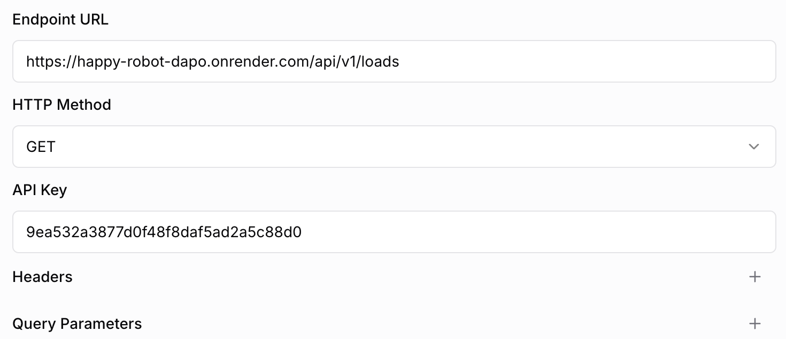

# Happy Robot Use Case

## Notes
> [!IMPORTANT]
> I made a slightly different API decision besides the one in the original challenge. I wasn't able to configurate the HappyRobot platform to send a custom path param. As you can see on the image, it's only available to send custom query params. So I decided to use a different approach to reach the same result. That's why the endpoint is different from the one in the original challenge.

## Demos

You can watch a demo video of the project in action here:
1. Situation 1 (1:31): I provide the MC number & reference number load [demo video](https://www.loom.com/share/be804dc178404bdea7b5ba8bf36acce5?sid=21f171c8-c43e-4f71-a4b0-3a3b599a618c)
2. Situation 2 (2:39): I provide the DOT number and give some filters to find the post I saw online [demo video](https://www.loom.com/share/6a6b8b4d88ae4bbfafe76de3b38ebcc0?sid=c61f0abf-7970-4e41-a96a-6bcc4d912c31)
3. Overview of the project (1:13): Very quick overview of the repository and showcase of the swagger page. [demo video](https://www.loom.com/share/4cedf523efc94826b232313aa2ca188b?sid=65704d5b-3b84-41b8-a710-af6f3b703dd7)

The happy robot platform use case link is [here](https://app.happyrobot.ai/use-cases/6723195ed1f0053ba28b51f6?use-case-id=67e1f6f4139c8f4fff5f2746&prompt-id=a103431e-9a67-4d3b-ad05-d26454d1b861).

The public API is deployed here: https://happy-robot-dapo.onrender.com/api/v1 (as long as the free tier of render allows it).

## Posible Improvements
- Add more proper error handling
- Add tests
- Move CSV data to a real DB
- Configure a proper CI/CD pipeline
- Send logs to a db
